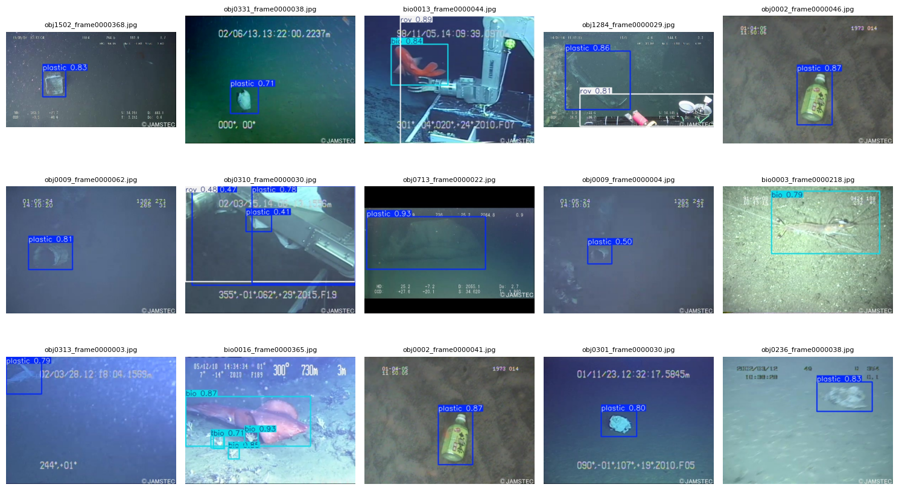

# Underwater Debris Detection using YOLO

## Overview

This project showcases a custom-trained YOLO (You Only Look Once) model designed to detect underwater debris. 
Underwater debris poses significant threats to marine ecosystems, and detecting it accurately can support conservation and cleanup initiatives.

Using a specially curated dataset of underwater images, the YOLO model was trained and evaluated to identify various types of debris in different aquatic environments.

*Example of debris detection using the YOLO model.*

## Key Features

- **Custom Dataset:** Collected and annotated underwater debris images.
- **YOLO-based Detection:** Real-time object detection optimized for underwater visuals.
- **Environmental Impact:** Supports efforts in marine conservation and pollution tracking.

